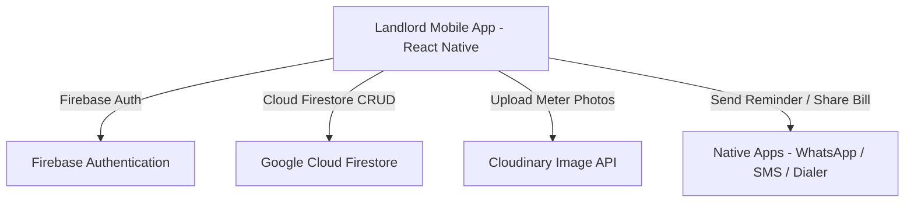

# Software Requirements Specification (SRS) for myTenant

## 1. Introduction

### 1.1 Purpose
This System Requirements Specification (SRS) document defines the software and functional requirements for **myTenant** (also referred to as `myTenantApp`), a cross-platform mobile application designed for landlords and property managers to streamline property management, room rentals, tenant history tracking, monthly electricity reading calculations, payment status management, and automated reminder/bill delivery.

### 1.2 Scope
`myTenant` provides an end-to-end digital property management system. Key capabilities include:
- **Authentication**: Email/Password authentication and Google OAuth integration via Firebase.
- **Room Management**: Creation, updating, and deletion of property rental rooms, including rent structure, security deposit (advance), and baseline electricity meter readings.
- **Tenant Management**: Association of primary tenants and additional occupants (family/roommates) with individual rooms, keeping historic record logs when tenants move.
- **Utility & Electricity Billing**: Monthly meter reading logging, Cloudinary image upload of meter photos, unit consumption calculation, and total payable auto-generation.
- **Payment Lifecycle**: Support for Paid, Unpaid, and Partial Payment states with residual balance tracking.
- **Notification & Reminders**: Formatting and direct sharing of monthly breakdown statements via WhatsApp, SMS, native phone dialer, and image view-shot sharing.
- **Landlord Profile Configuration**: Maintenance of landlord contact phone numbers and UPI payment handles used in automated payment requests.

### 1.3 System Overview Architecture
- **Mobile Framework**: React Native v0.83.1 (React 19.2.0)
- **State Management**: Redux Toolkit (`@reduxjs/toolkit` v2.11.2)
- **UI & Styling**: React Native Paper v5.14.5 (Material Design 3), React Native Vector Icons, Lottie React Native
- **Backend & Database**: Firebase Authentication, Google Sign-In SDK, Google Cloud Firestore (`@react-native-firebase/firestore` v23.7.0)
- **Cloud Storage**: Cloudinary (for proof of meter reading image hosting)
- **Navigation**: React Navigation v7 (Native Stack + Bottom Tabs)

---

## 2. Overall Description

### 2.1 Product Perspective
`myTenant` operates as a standalone mobile application communicating directly with Google Firebase services and Cloudinary APIs via HTTPS. It eliminates manual ledger books and complex spreadsheet formulas for landlords by automating per-unit electricity calculations and generating instant text/image bills with embedded payment details.

### 2.2 User Classes and Characteristics
- **Landlord / Property Manager (Primary User)**: Manages properties, enters meter readings, collects rent, and sends payment reminders. Requires an intuitive visual summary of total dues and simple 1-click sharing options.
- **Tenant (End Beneficiary)**: Receives formatted monthly statements containing previous reading, current reading, units used, electricity bill, base rent, and landlord UPI details.

### 2.3 Operating Environment
- **Operating Systems**: Android 6.0 (API Level 23) and above; iOS 13.0 and above.
- **Network**: Internet connection required for real-time Firebase synchronization and Cloudinary image uploads.
- **Device Hardware**: Camera/Gallery permissions for meter photo capture, phone call/SMS capabilities.

---

## 3. Functional Requirements Specification

### 3.1 Module 1: Authentication & User Session (FR-AUTH)

| Requirement ID | Feature Name | Description | Priority |
| :--- | :--- | :--- | :--- |
| `FR-AUTH-01` | Email/Password Registration | Landlords can create an account using email and password with validation. | High |
| `FR-AUTH-02` | Email/Password Login | Registered landlords can log into their account using email/password. | High |
| `FR-AUTH-03` | Google OAuth Sign-In | Landlords can log in or sign up seamlessly using Google Sign-In SDK. | High |
| `FR-AUTH-04` | Session Persistence | User auth token (UID) is stored in native `AsyncStorage` to maintain logged-in state across app restarts. | High |
| `FR-AUTH-05` | Logout | Landlords can safely log out, clearing local storage tokens and resetting Redux state. | Medium |

### 3.2 Module 2: Home Dashboard & Aggregated Analytics (FR-DASH)

| Requirement ID | Feature Name | Description | Priority |
| :--- | :--- | :--- | :--- |
| `FR-DASH-01` | Total Rooms Counter | Displays the total number of registered rooms owned by the landlord. | Medium |
| `FR-DASH-02` | Total Base Rent Summary | Calculates and displays the total expected base rent across all active rooms. | High |
| `FR-DASH-03` | Monthly Electricity Collection | Summarizes the total electricity bill collected in the current calendar month (`MMYY`). | High |
| `FR-DASH-04` | Cumulative Revenue Summary | Computes the grand total sum (`Total Rent + Current Month Electricity`). | High |
| `FR-DASH-05` | Lifetime Electricity Collection | Aggregates all paid electricity records across the entire property history. | Medium |
| `FR-DASH-06` | Pull-to-Refresh | Allows manual pull-to-refresh to re-fetch rooms, tenants, and records from Firestore. | Medium |

### 3.3 Module 3: Room Management (FR-ROOM)

| Requirement ID | Feature Name | Description | Priority |
| :--- | :--- | :--- | :--- |
| `FR-ROOM-01` | Room Creation | Landlords can add a room with Room Name, Room Number, Monthly Rent, Advance/Deposit, Electricity Rate (Per Unit), and Initial Meter Reading. | High |
| `FR-ROOM-02` | Room List Display | Displays rooms in a list with swipeable actions (`AppleStyleSwipeableRow`). | High |
| `FR-ROOM-03` | Room Editing | Allows editing existing room properties (rent amount, per-unit rate, start reading). | Medium |
| `FR-ROOM-04` | Room Deletion | Landlords can delete a room after confirmation dialog prompt. | High |

### 3.4 Module 4: Tenant Management (FR-TENANT)

| Requirement ID | Feature Name | Description | Priority |
| :--- | :--- | :--- | :--- |
| `FR-TENANT-01` | Tenant Registration | Associate a primary tenant with a room, including Name, Mobile Phone, Aadhar Number, and Start Date. | High |
| `FR-TENANT-02` | Co-Tenants / Family Members | Support adding multiple occupants under one primary tenant with name, phone, and Aadhar details. | Medium |
| `FR-TENANT-03` | Tenant History Log | Retains previous tenant records when a new tenant is assigned to the room. | High |
| `FR-TENANT-04` | Quick Phone Dialer | Tapping a tenant's phone number triggers the native phone dialer (`onOpenDialer`). | Low |

### 3.5 Module 5: Meter Readings & Utility Billing (FR-BILL)

| Requirement ID | Feature Name | Description | Priority |
| :--- | :--- | :--- | :--- |
| `FR-BILL-01` | Monthly Reading Entry | Landlord logs the current meter reading; the app computes `totalUnitBurned = newReading - previousReading`. | High |
| `FR-BILL-02` | Electricity Amount Calculation | Automatically computes `totalAmount = totalUnitBurned * perUnitRate`. | High |
| `FR-BILL-03` | Meter Image Upload | Integrates Cloudinary to upload and link a proof photograph of the physical meter to the monthly record. | High |
| `FR-BILL-04` | Baseline Reading Update | Upon successful record entry, room baseline reading (`startReading`) automatically updates to `newReading`. | High |
| `FR-BILL-05` | Payment Status Tracking | Supports `Paid`, `Unpaid`, and `Partial Paid` status tags with visual color highlights. | High |
| `FR-BILL-06` | Partial Payment Logging | Landlords can record partial payments, updating `paidAmount` and remaining `pendingAmount`. | High |

### 3.6 Module 6: Reminder & Share Communication (FR-COMM)

| Requirement ID | Feature Name | Description | Priority |
| :--- | :--- | :--- | :--- |
| `FR-COMM-01` | WhatsApp Bill Reminder | Generates a structured Markdown statement (old reading, new reading, units, electricity, rent, total payable, UPI) and launches WhatsApp. | High |
| `FR-COMM-02` | SMS Reminder | Formats an SMS message with bill totals and landlord payment details. | Medium |
| `FR-COMM-03` | Share Bill Modal & Snapshot | Displays a full visual bill receipt and allows native sharing/image export. | Medium |

### 3.7 Module 7: Landlord Profile & Settings (FR-PROF)

| Requirement ID | Feature Name | Description | Priority |
| :--- | :--- | :--- | :--- |
| `FR-PROF-01` | Profile Update | Landlord updates Name, Phone Number, and UPI Address required for billing tags. | High |
| `FR-PROF-02` | Validation & Feedback | Validates 10-digit Indian phone numbers (`/^(?:(?:\+|0{0,2})|[0]?)?[6789]\d{9}$/`) and required fields. | High |

---

## 4. Non-Functional Requirements

### 4.1 Security Requirements
- **Data Encapsulation**: Firestore database paths are scoped under `/users/{uid}/`, ensuring isolation between landlords.
- **Authentication Credentials**: Sensitive operations require valid Firebase ID tokens.
- **Third-Party Keys**: Web Client ID and Cloudinary upload credentials must be restricted in production builds.

### 4.2 Performance & Responsiveness
- **Screen Transitions**: Screen navigation powered by `@react-navigation/native-stack` with smooth right-slide transitions.
- **Asynchronous Data Loading**: Redux Toolkit slices handle dynamic updates; loaders block interaction during active network calls.
- **List Optimization**: `VirtualizedScrollView` and `FlatList` with optimized key extractors ensure smooth 60 FPS scrolling.

### 4.3 Reliability & Availability
- Offline fallback indicators via native flash messages when network queries fail.
