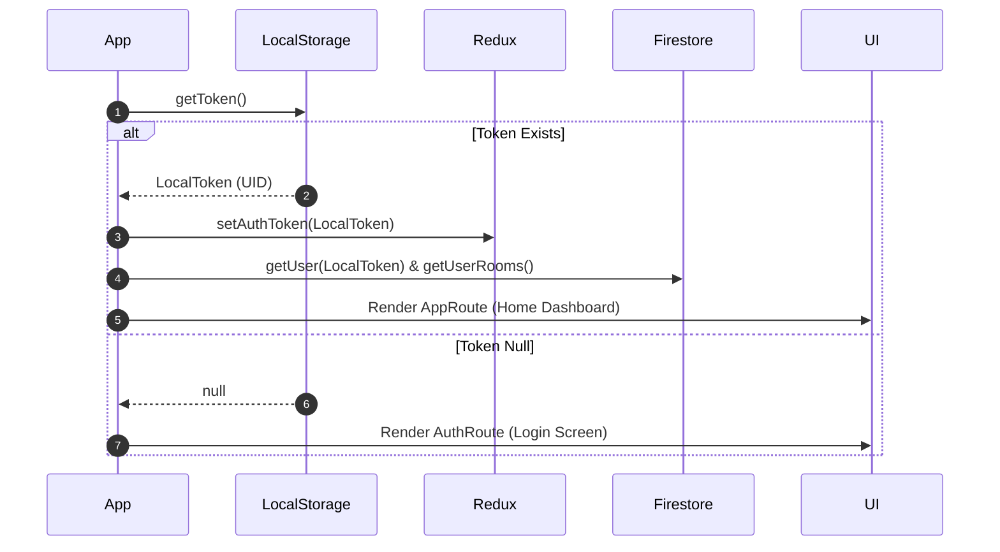

# Authentication and Onboarding Design Document (`02_authentication_and_onboarding.md`)

## 1. Module Overview
The Authentication module manages user onboarding, splash initializing logic, authentication persistence via local storage, email/password credential sign-in and sign-up, and native Google OAuth authentication.

---

## 2. Screen Specifications

### 2.1 Splash Screen (`Src/Components/SplashScreen.js`)
- **Purpose**: Displays brand logo and loading animation while inspecting local storage for an active session token.
- **Workflow & Lifecycle (`App.js:87-99`)**:
  1. On initial mount, `App.js` calls `registerTranslation('en', en)` and checks `LocalStorage.getToken()`.
  2. If `LocalToken` exists:
     - Dispatches `setAuthToken(LocalToken)` to Redux.
     - Invokes `getUser(LocalToken)` and `getUserRooms()` to prefill store data.
  3. Displays `SplashScreen` component for 3000ms timer before revealing app stack.

---

### 2.2 Login Screen (`Src/Screens/Auth/Login.js`)

#### A. UI Layout & Visual Design
- **Illustration**: Vector graphics banner (`undraw_Calculator_re_alsc.png`).
- **Form Controls**: Outlined `TextInput` fields for Email and Password with Yup validation helpers.
- **Actions**:
  - Primary "Login" Button (Elevated React Native Paper button).
  - "Forgot your password?" touch link.
  - "Continue with Google" custom button with SVG Google Icon.

#### B. Validation Schema (Yup)
- `email`: Required, valid email format.
- `password`: Required, minimum 2 characters.

#### C. Authentication Execution Flows

##### Email/Password Login (`_onLoginPressed`):
1. Sets `loading = true`.
2. Calls `auth().signInWithEmailAndPassword(email, password)`.
3. Fetches user document from Firestore: `getUser(user.uid)`.
4. Saves UID to native storage: `LocalStorage.storeToken(user.uid)`.
5. Dispatches token to Redux: `dispatch(setAuthToken(user.uid))`.
6. Handles Firebase error codes:
   - `auth/email-already-in-use`: Display toast error.
   - `auth/invalid-email`: Display toast error.
   - `auth/invalid-credential`: Display toast error.

##### Google Sign-In (`_onGoogleLoginPress`):
1. Configured Web Client ID: `515928874687-irhbrofvs1bpgmrcd3hpuu510c3epr6f.apps.googleusercontent.com`.
2. Checks Google Play Services availability: `GoogleSignin.hasPlayServices()`.
3. Obtains ID token from Google SDK: `GoogleSignin.signIn()`.
4. Generates credential: `auth.GoogleAuthProvider.credential(idToken)`.
5. Authenticates with Firebase: `auth().signInWithCredential(googleCredential)`.
6. Creates or merges user record in Firestore (`addUser(user)`).
7. Fetches updated user state (`getUser(user.uid)`).
8. Persists UID to local storage and updates Redux state.

---

### 2.3 Sign Up Screen (`Src/Screens/Auth/Signup.js`)

#### A. UI Layout & Form Inputs
- Outlined Input fields for Email and Password.
- "Sign Up" primary button.
- "Login" navigation fallback button.

#### B. Registration Logic (`_onSignupPressed`):
1. Calls `auth().createUserWithEmailAndPassword(email, password)`.
2. Creates user entry in Firestore `users/{uid}` via `addUser(response.user)`.
3. Displays success message: `"Account created successfully"`.
4. Navigates to `RoutesName.LOGIN`.

---

## 3. Security & Error Handling Matrix

| Edge Case / Error Code | Handling Strategy | User UI Feedback |
| :--- | :--- | :--- |
| Invalid Email Format | Caught by Yup Validation | Inline red text helper: `"Well that's not an email"` |
| `auth/invalid-credential` | Caught in `catch` block | Top floating flash message banner: `"Invalid user credential"` |
| Google Play Services Missing | Google Sign-In SDK prompt | Triggers native Google dialog prompt |
| Network Timeout | Firebase Exception catch | Top floating flash message with error details |
