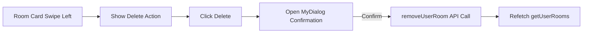

# Room and Tenant Management Design Document (`04_room_and_tenant_management.md`)

## 1. Module Overview
This module governs property rooms, active tenant assignments, historical tenant records, occupant details, and swipe-to-delete interactions.

---

## 2. Component Specifications

### 2.1 My Rooms Screen (`Src/Screens/App/MyTenant.js`)

#### A. UI & Components
- **Header (`Header.js`)**: Title `"My Rooms"`.
- **FlatList**: Displays property rooms wrapped inside `AppleStyleSwipeableRow`.
- **Empty State (`EmptyComponent.js`)**: Renders Lottie / SVG empty graphic when `rooms.length === 0`.
- **Floating Action Button (`FAB`)**: Fixed bottom-right `plus` icon triggering `AddRoomModal`.
- **Swipeable Delete**: Swiping a room card right-to-left reveals red delete action which triggers deletion confirmation modal (`MyDialog`).



#### B. Data Operations (`Collections.js`)
- `getUserRooms()`: Queries Firestore `users/{uid}/rooms`, sorts doc list by creation timestamp, and updates `selectUserRooms` in Redux.
- `removeUserRoom(roomId)`: Deletes specified room document and triggers room list refetch.

---

### 2.2 Add / Edit Room Modal (`Src/Components/Modals/AddRoomModal.js`)

#### A. Form Fields & Validation
Managed via **Formik** and **Yup**:
- `roomName`: String, required.
- `roomNo`: Numeric string, required.
- `rent`: Numeric string (Monthly Base Rent in INR), required.
- `advance`: Numeric string (Security Deposit / Advance in INR), required.
- `perUnit`: Numeric string (Electricity Rate per kWh/Unit in INR), required.
- `startReading`: Numeric string (Initial baseline meter reading), required.

#### B. Execution Logic
- **Add Mode (`addUserRoom`)**: Creates new document in `users/{uid}/rooms` with `createdAt: Date.now()` and empty `currentTenantId`.
- **Edit Mode (`updateUserRoom`)**: Updates target room document `users/{uid}/rooms/{roomId}` with modified rates/metadata.

---

### 2.3 Room Details Screen (`Src/Screens/App/RoomDetails.js`)

#### A. Visual Layout
- **Header**: Shows current room name with an edit pencil icon in the top right header navigation bar.
- **Tenant Details Banner (`LinearGradient`)**:
  - Gradient background: `['#A855F7', '#6366F1']`.
  - Shows current tenant name, room rent, tenancy start date, mobile number, Aadhar number, and occupant list.
  - Interactive "View More / View Less" toggle for co-tenants.
- **Current Tenant Action Card**: Displays last bill paid amount and last paid month. Tapping card navigates to `MonthlyBreakdown`.
- **Tenants History Section (`TenetDetailCard.js`)**: Lists previous tenants who previously occupied this room.

```
+-------------------------------------------------------------+
| [Gradient Card] Tenant Details               (Pencil Edit)  |
| Rent: ₹ 5000 | Start Date: 01 January 2026                 |
| Name: John Doe | Mobile: 9876543210                         |
| Aadhar: XXXX-XXXX-1234                                      |
| Members: Member 1 (Jane Doe), Member 2 (Child)              |
+-------------------------------------------------------------+
| Current Tenant Card: John Doe                               |
| Last Bill Paid: ₹ 6500 | Month: January 2026                |
+-------------------------------------------------------------+
| History                                                     |
| [TenetDetailCard] Previous Tenant: Alex Smith (2024-2025)   |
+-------------------------------------------------------------+
```

---

### 2.4 Add / Edit Tenant Modal (`Src/Components/Modals/AddTenetModal.js`)

#### A. Form Structure & Occupant Management
- Primary Tenant Fields: Name, Phone (10-digit validation), Aadhar Number, Tenancy Start Date picker (`react-native-paper-dates`).
- Dynamic Occupants Array (`FieldArray` / dynamic state): Allows adding co-tenants with Name, Phone, and Aadhar details.

#### B. Execution Logic (`addRoomTenet` / `updateRoomTenet`)
1. Creates tenant record under `users/{uid}/rooms/{roomId}/Tenants`.
2. Formats start date string as `"DD-MMMM-YYYY"`.
3. Updates target room document (`updateUserRoom`) setting `currentTenantId` to new tenant ID, `tenetName`, and `startDate`.
4. Refetches room tenant collection via `getUserRoomsTenants()`.
